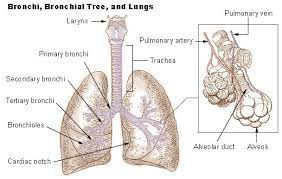

# Lungs

Lungs is the respiratory organ in humans.It is how we breathe. We take in air (oxygen) through our noses and we breathe out carbon dioxide which we have no need for through the notes and the oxygen goes to all parts of our body through the lungs
